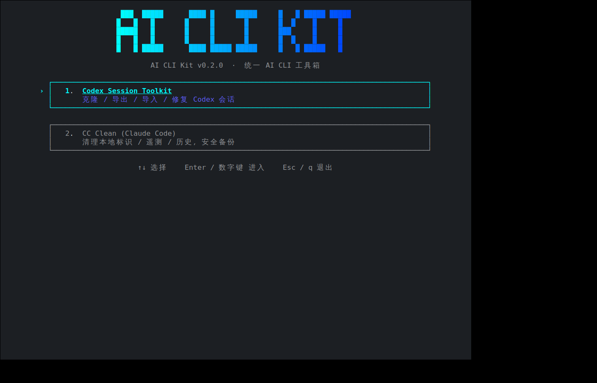
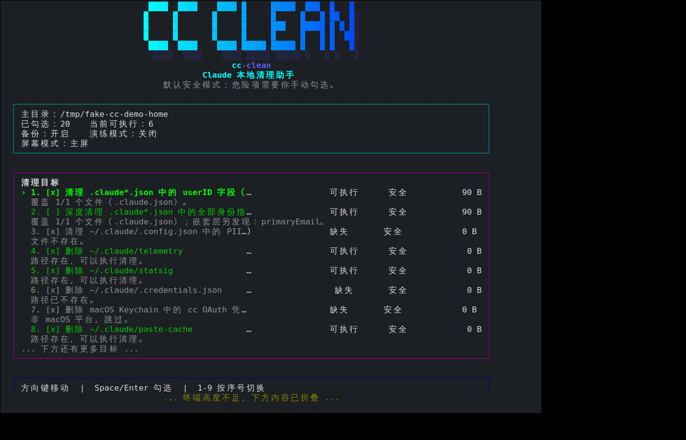

# AI CLI Kit (`aik`)

上游仓库：[goodnightzsj/codex-session-cloner](https://github.com/goodnightzsj/codex-session-cloner.git)

`ai-cli-kit` 是一个本地 AI CLI 工具箱。打包了两个子工具，共享同一套底层（原子写入 / 跨进程锁 / TUI 渲染 / Windows VT / UTF-8 launcher）：

| 子工具 | 用途 | 兼容入口 |
|---|---|---|
| **Codex Session Toolkit** | 浏览 / 迁移 / 导入导出 / 修复 Codex 会话 | `cst` / `codex-session-toolkit` |
| **CC Clean (Claude Code)** | 安全清理 Claude 本地标识 / 遥测 / 历史，自动备份 | `cc-clean` |


| `aik` 顶层 hub | CC Clean 子工具 |
|---|---|
|  |  |

## 选哪种运行方式？

| 方式 | 命令 | 需要安装吗？ | 会在 PATH 里多命令吗？ |
|---|---|---|---|
| **launcher 直跑（最省事）** | `./aik` / `./codex-session-toolkit` / `./cc-clean` | ❌ 不需要 | ❌ 否（项目目录内） |
| **`python -m` 直跑** | `python -m ai_cli_kit[.codex|.claude]` | ✅ 需要（或 `PYTHONPATH=src`） | ❌ 否 |
| **标准安装 + console scripts** | 全局 `aik` / `cst` / `cc-clean` | ✅ `./install.sh` | ✅ venv/bin 注册 4 个命令 |
| **极简安装（不要命令）** | `./install.sh --no-scripts` + `python -m ai_cli_kit` | ✅ 但仅装包 | ❌ 否（脚本被剔除） |

不知道选哪个？**直接 `git clone` 后跑 `./aik`**，零安装、零污染、立即可用。

### 一键安装（macOS / Linux）

```bash
chmod +x install.sh aik cc-clean codex-session-toolkit codex-session-toolkit.command
./install.sh                  # 标准安装：venv/bin 注册 aik / cst / codex-session-toolkit / cc-clean
./install.sh --no-scripts     # 极简安装：装包但不注册任何命令，只能 python -m 用
./install.sh --editable       # 开发模式（pip install -e）
./aik                         # 进入交互菜单
```

### 一键安装（Windows）

双击 `install.bat`，再双击 `aik.cmd`。或：

```powershell
.\install.ps1                 # 标准安装
.\install.ps1 -NoScripts      # 极简安装：装包但不注册命令
.\aik.cmd
```

### `python -m` 直跑（不想注册任何命令）

```bash
# 在项目目录内（无需 pip install）
PYTHONPATH=src python -m ai_cli_kit              # 顶层菜单
PYTHONPATH=src python -m ai_cli_kit.codex        # 直接进 Codex
PYTHONPATH=src python -m ai_cli_kit.claude       # 直接进 CC Clean

# 或者用 make 包裹（自动设 PYTHONPATH）
make run            # 顶层菜单
make run-codex      # Codex 子工具
make run-claude     # CC Clean

# 已 pip install 后（无需 PYTHONPATH，任意目录）
python -m ai_cli_kit
python -m ai_cli_kit.codex
python -m ai_cli_kit.claude
```

### 进 TUI 后

无参运行 `./aik`（或 `python -m ai_cli_kit`）→ 用 ↑↓ 选 **Codex Session Toolkit** 或 **CC Clean** → Enter 进入对应工具的菜单。

## 常用命令

### Codex（会话管理）

```bash
./aik codex list                       # 列出本机 Codex 会话
./aik codex export <session_id>        # 导出单个会话为 Bundle
./aik codex export-desktop-all         # 批量导出 Desktop 会话
./aik codex import <session_id>        # 导入 Bundle
./aik codex clone-provider             # 切换 provider 后克隆
./aik codex repair-desktop             # 修复 Desktop 可见性 / 索引
./aik codex --help                     # 完整子命令清单
```

兼容写法：把 `./aik codex` 换成 `./codex-session-toolkit` 即可，参数完全一致。

### CC Clean（Claude 本地清理）

```bash
./aik claude plan                              # 预览默认安全清理计划
./aik claude clean --preset safe --yes         # 执行安全清理（自动备份）
./aik claude clean --preset full --yes         # 完整重置（含会话数据，慎用）
./aik claude remap-history --run-claude --yes  # 重新生成新 ID 并回写历史
./aik claude restore <backup-path> --yes       # 从备份目录还原
./aik claude prune-backups --keep 5 --yes      # 清理旧备份目录
./aik claude debug-paths --format json         # 诊断：查看解析后的路径 + env
./aik claude list-targets                      # 列出所有清理目标键名
./aik claude --help
```

兼容写法：`./aik claude` 等价于 `./cc-clean`。

**清理覆盖范围（40+ targets）**：

```
身份/凭据：state_user_id, state_full_identity, legacy_state_file, credentials_file,
            macos_keychain (含 16 服务名变体), settings_auth_env
PII / 缓存：telemetry, statsig, paste-cache, dump-prompts, traces, file-history,
            image-cache, stats-cache, startup-perf, usage-data, uploads (bridge)
状态/索引：plugins, debug, ide, teams, session-env, agent-memory, mcp-needs-auth-cache,
            policy-limits, remote-settings, computer-use.lock, output-styles, completion.*
旧备份：   ~/.claude/backups/.claude*.json.{backup,corrupted}.* + 旧版 HOME 直下兼容
危险（默认不勾）：projects, history, sessions, user_claude_md, plans, jobs, tasks
环境重定向（动态）：CLAUDE_CONFIG_DIR / CLAUDE_COWORK_MEMORY_PATH_OVERRIDE /
                  CLAUDE_CODE_PLUGIN_CACHE_DIR / CLAUDE_CODE_REMOTE_MEMORY_DIR
                  / CLAUDE_CODE_TMPDIR
跨 OS：    Windows 长路径 + 保留名 sanitize / NTFS junction 守卫 /
          macOS NFC 路径 / POSIX 0o700 备份目录权限
```

**安全机制**：

- 默认所有删除走 `~/.claude-clean-backups/<时间戳-uuid>/` 备份目录，POSIX 上 0o700 + 内文件 0o600
- 备份带 `_cc_clean_meta.json` sidecar 记录原始 anchor，确保 restore 能还原到正确位置
- restore 严格防路径穿越：trusted-anchor whitelist + commonpath 边界 + dst 父链 realpath
- 跨进程文件锁防并发（execute_plan / restore / prune-backups 三入口）
- 异常消息脱敏（不在 JSON 输出中泄露文件路径）
- `--no-backup` 显式关闭备份；`--dry-run` 只预览不动磁盘

**JSON 模式**：所有子命令支持 `--format json` 输出单文档 envelope `{command, status, ...}`，`status` 为 `ok` / `partial` / `error` / `empty`。`--format=json` 模式下未传 `--yes` 且非 `--dry-run` 时拒绝执行（防自动化脚本无意识破坏数据）。

## 制作发布包

```bash
./release.sh
# 输出 dist/releases/ai-cli-kit-<version>.tar.gz / .zip
```

对方解压后跑 `./install.sh`（macOS / Linux）或 `install.bat`（Windows）即可。

## 工程命令

```bash
make help          # 看所有 target
make bootstrap     # 等价 ./install.sh
make test          # 跑全部单测（需 PYTHONPATH=src）
make check         # compile + test + launcher smoke
make release       # 等价 ./release.sh
```

---

<div align="center">

**学 AI，上 L 站**

[](https://linux.do/)

本项目在 [LINUX DO](https://linux.do/) 社区发布与交流。

</div>

## Star History

<picture>
  <source media="(prefers-color-scheme: dark)" srcset="https://api.star-history.com/svg?repos=goodnightzsj/codex-session-cloner&type=Date&theme=dark">
  <source media="(prefers-color-scheme: light)" srcset="https://api.star-history.com/svg?repos=goodnightzsj/codex-session-cloner&type=Date">
  
</picture>

## 许可证

MIT License
